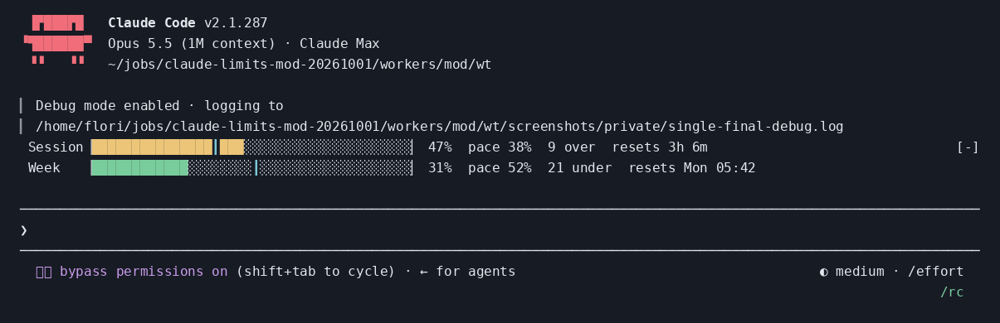
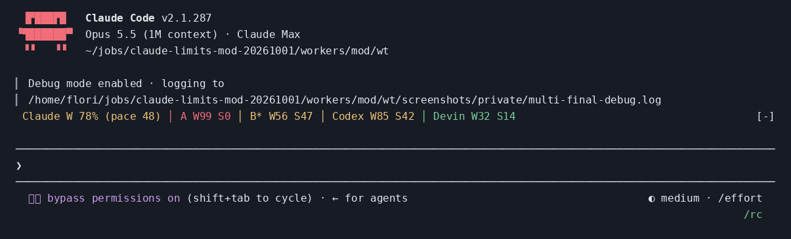
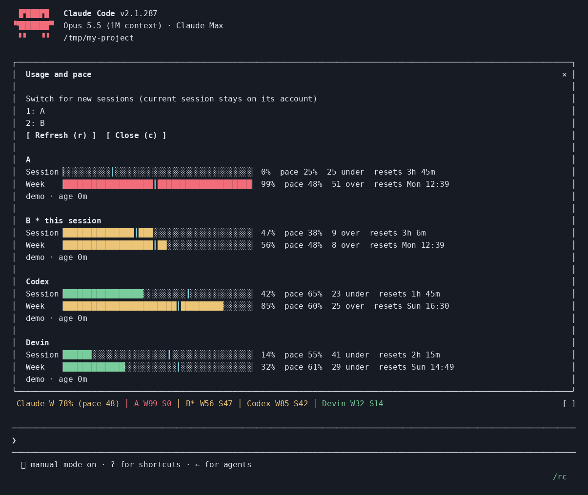

# LimitPace

LimitPace puts subscription usage beside its pace line above the Claude Code prompt. See whether a five-hour or weekly allowance is ahead of schedule, compare Claude accounts and other providers, and open an account switcher with `/limitpace`. An optional advisor gives Claude provider-neutral delegation guidance.

Requires Claude Code **2.1.287 or later**, the first version with mods. No dependencies, no build step, no telemetry.

The images below are captures of LimitPace running in Claude Code at 120 columns with fixed demo data.







## Install

The repository is its own plugin marketplace:

```text
/plugin marketplace add fstandhartinger/limitpace
/plugin install limitpace@limitpace
/reload-plugins
```

Restart Claude Code if it does not appear after reloading. For one development session, use `claude --plugin-dir /path/to/limitpace`.

## Read the band

Green means usage is under its pace line; yellow means over pace; red means at least 90% used. The cyan `┃` marks elapsed time through that window. Pace is `(now − window start) / window length`, clamped to 0–100%; headroom is pace minus usage, in percentage points. Missing resets mean unknown pace, never an assumed zero. Session windows default to five hours and weekly windows to seven days; Codex durations and configured weekly durations override those defaults.

With one Claude account and no other providers, `auto` draws separate Session and Week bars. Multiple accounts or extra providers select the compact line. Combined Claude weekly usage and pace are weighted means of measured profiles; each profile defaults to weight 1. `*` marks this session's account. At narrow widths, the compact line drops session percentages, then pace detail, then trailing providers; the pane always lists every provider. Errors show briefly in the band and in full in the pane. Reset days and times use the host's local timezone.

`/limitpace` opens the pane; its account buttons have hotkeys 1–9. Switching applies to **new sessions**. Without a configured switch command, a button copies a `CLAUDE_CONFIG_DIR=... claude` launch command. Refresh and Close have hotkeys `r` and `c`.

`/limitpace refresh` forces a new usage check and returns a plain summary. `/limitpace text` returns the summary without opening anything. The command also returns text on surfaces with no mod drawing, such as the VS Code chat panel. Completely non-interactive sessions with the advisor off remain inert, including not registering the command; opt in to an advisor mode when using the command in `claude -p` or the SDK.

## Configure

Four fields appear in the plugin's configuration picker:

| Field | Default | Values |
| --- | --- | --- |
| `layout` | `auto` | `auto`, `detailed`, `compact`, `off` |
| `config_file` | `~/.config/limitpace/config.json` | Optional JSON file, or `demo:single` / `demo:multi` |
| `advisor` | `off` | `off`, `prompt`, `file`, `both` |
| `refresh_minutes` | `5` | 1–60 |

For an installed plugin, values live under `pluginConfigs["limitpace@limitpace"].options` in Claude Code settings. For `--plugin-dir`, use `limitpace@inline`. For example:

```json
{
  "pluginConfigs": {
    "limitpace@inline": {
      "options": {
        "layout": "auto",
        "config_file": "~/.config/limitpace/config.json",
        "advisor": "off",
        "refresh_minutes": 5
      }
    }
  }
}
```

The config file is optional and every key is optional. With no file, LimitPace measures exactly the current Claude account and uses the detailed band. Invalid JSON gives a dim explanation and falls back to that account. Changes to the config file take effect after `/reload-plugins` or a restart.

Use [the minimal example](examples/config.minimal.json) for a single account, or [the multi-account example](examples/config.multi.json) for two Claude accounts, Codex and a local Devin quota sample. That example has no account-switch command, because each account there lives in its own `CLAUDE_CONFIG_DIR`. A general example is:

```json
{
  "claudeProfiles": [
    {"label": "A", "configDir": "~/.claude-A", "weight": 1},
    {"label": "B", "configDir": "~/.claude", "weight": 1}
  ],
  "switchCommand": ["claude-account", "switch", "{label}"],
  "providers": [
    {"id": "codex", "label": "ChatGPT/Codex", "type": "codex", "authFile": "~/.codex/auth.json", "delegate": "codex exec"},
    {"id": "devin", "label": "Devin", "type": "json", "path": "~/.local/state/agent-limits/devin-latest.json",
      "map": {"weekPercent": "weekly_percent", "weekResetsAt": "weekly_reset_at"}, "delegate": "devin"},
    {"id": "other", "label": "Other", "type": "command", "argv": ["my-usage", "--json"],
      "map": {"weekPercent": "week.used", "weekResetsAt": "week.reset"}}
  ],
  "advisor": {"target": "auto", "minChangePoints": 5, "createIfMissing": false}
}
```

`configDir`, `authFile`, and `path` support `~`. File paths otherwise follow Claude Code's working-directory rules. The current Claude profile is the one whose config directory equals `CLAUDE_CONFIG_DIR`, or `~/.claude` when that variable is unset. Give each provider a unique id and each Claude profile its own directory.

A `json` provider reads a local file. A `command` provider runs only its configured argv and parses stdout as JSON. `map` maps these five keys to dotted JSON paths:

| Key | Meaning |
| --- | --- |
| `sessionPercent` | Session percentage, 0–100 |
| `sessionResetsAt` | Session reset time |
| `weekPercent` | Weekly percentage, 0–100 |
| `weekResetsAt` | Weekly reset time |
| `weekWindowDays` | Weekly window length, default 7 days |

Without a map, the JSON keys above are used directly. Reset values may be ISO timestamps, epoch seconds or epoch milliseconds. Missing percentages stay unknown. A successful external reading is cached under its own source-specific store key. Other sessions re-read that key before fetching. This reduces duplicate checks but is not an atomic cross-session lock; simultaneous first fetches can still race. HTTP 429 retains the last successful reading, shows an error, and waits until the next refresh interval before retrying. Manual Refresh deliberately bypasses cache freshness.

Some setups keep one config directory and swap logins in and out of it, storing each account's login in its own file
(for example `~/.claude/accounts/<label>.json`, in the same `claudeAiOauth` shape as `.credentials.json`). Give those
profiles a `credentialsFile` ([example](examples/config.profile-swap.json)). LimitPace reads the inactive accounts from
their own files, and marks as current the profile whose stored login matches the live one (compared in memory, never
stored). Pair it with a `switchCommand` so the pane's buttons can swap accounts.

On macOS, additional Claude accounts may use Keychain instead of `.credentials.json`. Configure an optional `tokenCommand` on that profile:

```json
{
  "claudeProfiles": [
    {"label": "Work", "configDir": "~/.claude-work", "tokenCommand": ["my-keychain-reader", "--access-token"]}
  ]
}
```

The command must print only an existing access token. LimitPace never refreshes it. Command failures and HTTP failures are reported with generic hints rather than displaying stdout, stderr or thrown messages.

### Demo mode

Set `config_file` to `demo:single` or `demo:multi` for fixed sample data with **zero file reads, network calls or configured processes**. Alternatively, a JSON config can contain `{"demo":"single"}` or `{"demo":"multi"}`. Loading that file requires one config read; after it is loaded, demo collection reads no credentials or provider files and makes no network requests. Account switching and advisor file writes are disabled in demos.

## Optional engine advisor

The advisor is off by default. It does not select a model, change Claude's routing or launch work. It compares provider/plan percentages to their pace lines and advises delegation to the eligible provider with the most weekly headroom. It excludes providers with errors, those at least 90% through their session window or 95% through their week, and providers without measured weekly pace. If nobody is under pace, it says so and recommends keeping delegation small.

Advice deliberately contains **no model ids**. The strongest available model can lead and exercise judgement; delegation depends on plan headroom rather than a hard-coded model family. Configured `delegate` strings explain how to use a provider. Claude subagents always use this session's Claude account.

- `prompt`: adds hidden prompt context on the first prompt, then only if the recommendation changes or any session/weekly headroom moves by at least `minChangePoints` (default 5). It preserves other context and registers `mcp__limitpace__usage` for fresh advice.
- `file`: maintains only the block between `<!-- limitpace:start -->` and `<!-- limitpace:end -->`. It chooses the project's `AGENTS.md` if present, otherwise `CLAUDE.md`. An explicit `advisor.target` can choose another path; relative targets are under the project root. No new file is created unless `createIfMissing` is true. Outside text remains byte-identical. Malformed or duplicate markers are left untouched. Rewrites require a significant recommendation/headroom change and at least 30 minutes since the last write. Timestamps are minute-rounded and change only on a rewrite, limiting prompt-cache churn.
- `both`: enables both behaviors.

The advice is a scheduling hint, not a quota guarantee. Unknown or stale data should be refreshed before important delegation decisions.

## What LimitPace reads, runs and sends

**Network:** only `https://api.anthropic.com/api/oauth/usage` for configured Claude profiles and `https://chatgpt.com/backend-api/wham/usage` for configured Codex providers. It sends an access token to that provider's usage endpoint, plus the required headers; Codex's account id is sent only to its own endpoint when present. No telemetry and no other destination is configured by LimitPace.

**Reads:** its optional JSON config, configured Claude profiles' `.credentials.json`, the configured Codex auth file, and configured JSON provider files. Advisor file mode also reads its chosen project instruction file. It reads `HOME` and `CLAUDE_CONFIG_DIR` only to resolve paths and identify the current profile. Current Claude limits come from the free `$.session.usage()` reading when available; before a response has populated them, the configured account is measured through its usage endpoint.

**Runs:** only argv you configure: `command` providers, `tokenCommand`, and account `switchCommand` when you press a button. No shell is used. Sample paths and commands are examples, not hidden dependencies.

**Writes:** usage readings in `$.store`, reactive session values in `$.state`, and the selected AGENTS.md/CLAUDE.md or explicit target only in advisor file mode. A switch button without a command writes a launch command to the clipboard. LimitPace never writes credentials or refreshes tokens. Tokens and account ids are never stored in readings, logged, drawn or returned. Exceptions and command output are not echoed into errors.

The host's usage cache stores only percentages, resets, source, age and error hints. Host calls pass through Claude Code's mod middleware, so an earlier mod may inspect or refuse those calls; only use plugins you trust.

## Surfaces and limitations

The band and pane are designed for the terminal and Code tab of Claude Desktop. The VS Code chat panel, SDK, cloud sessions and `claude -p` run hooks but do not draw mod UI; headless advisor-off sessions perform no background work. Claude Desktop WSL sessions currently do not load plugins. Surveys retain the band, and LimitPace includes other mods' band content.

The usage endpoint is the one Claude Code's `/usage` uses and may change. OAuth tokens that are missing or expired require opening a session on that profile; LimitPace does not renew credentials. The Codex usage endpoint may also change. Keychain profiles need their own read-only token helper. There is no built-in Devin credential reader: provide a local quota JSON sample or an explicit command.

Relative imports, state declarations, startup redraw and the pane have been verified on Claude Code 2.1.287. Generated build-specific types were inspected after loading. Account switching was tested with simulated commands; no actual account switch was executed. Desktop rendering has not been checked.

## Development

```bash
claude plugin validate --strict .
claude plugin validate --strict .claude-plugin/plugin.json
claude plugin test
node scripts/test-local.mjs
```

The first command checks the marketplace when both manifests exist; the second explicitly checks the plugin, imports, hooks and state contract. `hooks/hooks.json` has both `modules` and an empty top-level `hooks` object to satisfy the directory checklist; that shape passes local strict validation.

The official runner runs `tests/*.test.ts`, including actual host drawing tests. `scripts/test-local.mjs` runs the pure logic and deterministic host simulation tests with Node, independently of Claude Code's rollout. It does **not** certify Claude Code UI elements or hook dispatch. Preview regeneration uses `node scripts/render-previews.mjs`, then `python3 scripts/ansi-to-png.py screenshots/*.ansi` (Pillow and DejaVu Sans Mono required). Real captures and data belong in the gitignored `screenshots/private/` directory.

If the official runner reports that hooks modules are turned off by the rollout switch, installed mods cannot load in that process. Check again after the rollout changes; do not override the switch.
